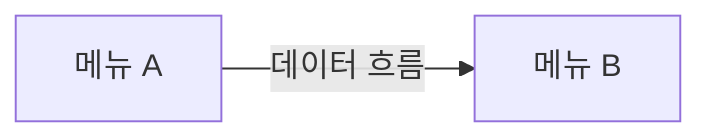

# {{SERVICE_NAME}} 인사이트

- 조사일: {{BENCHMARK_DATE}}
- 벤치마크 목적: {{BENCHMARK_GOAL}}

모든 항목에는 근거가 되는 메뉴 문서나 캡처 파일을 링크합니다.

## 1. 서비스 포지셔닝

- 대상 고객: <추정되는 주요 고객층과 규모>
- 핵심 가치: <이 서비스를 쓰는 가장 큰 이유>
- 서비스 범위: <어디까지 다루고 어디부터 다루지 않는지>

## 2. 정보 구조(IA) 특징

- <메뉴 구성 방식, 깊이, 사용자/관리자 화면 분리 방식 등>

## 3. 강점 Top 10

| # | 강점 | 관련 메뉴 | 근거 |
|---|---|---|---|
| 1 | <내용> | <menu_id> | <파일명> |

## 4. 약점·페인포인트 Top 10

| # | 약점 | 관련 메뉴 | 근거 | 영향도 (상/중/하) |
|---|---|---|---|---|
| 1 | <내용> | <menu_id> | <파일명> | |

## 5. 공통 UI 컴포넌트 패턴

| 컴포넌트 | 사용 위치 | 특징 | 예시 캡처 |
|---|---|---|---|
| 데이터 테이블 | <메뉴들> | <페이지네이션/무한스크롤, 컬럼 설정 여부 등> | <파일명> |
| 필터·검색 | | | |
| 입력 폼 | | | |
| 모달·패널 | | | |
| 사용자·조직 선택기 | | | |
| 에디터 | | | |
| 알림 | | | |

## 6. 메뉴 간 연동 지도

## 7. 요금제별 기능 차이

화면에서 확인할 수 있는 범위만 정리합니다.

| 기능 | 제한 요금제 | 근거 |
|---|---|---|
| <기능> | <요금제> | <업그레이드 안내 화면 등> |

## 8. 신규 서비스 기회 요소

| # | 기회 | 근거 (약점·빠진 기능) | 예상 가치 | 구현 난이도 |
|---|---|---|---|---|
| 1 | <내용> | <근거> | 상/중/하 | 상/중/하 |

## 9. MVP 후보 기능

| 우선순위 | 기능 | std_feature_id | 이유 |
|---|---|---|---|
| P0 (필수) | <기능> | <ID> | <이유> |
| P1 (초기 차별화) | | | |
| P2 (이후) | | | |

## 10. 추가 조사가 필요한 부분

- <확인하지 못한 기능, 다른 요금제·권한으로 다시 볼 부분, 모바일 앱 등>
