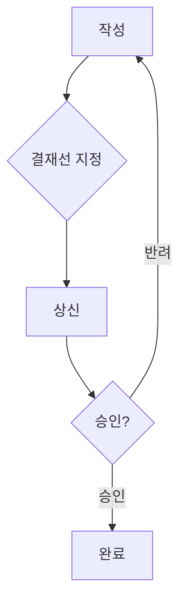
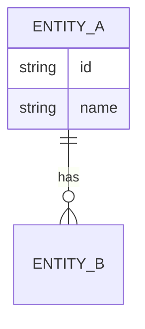

# {{SERVICE_NAME}} · <메뉴명> (`{{MENU_ID}}`)

- 조사일: {{BENCHMARK_DATE}}
- 표준 분류: <std_category>
- 진입 경로: <대메뉴 > 중메뉴>

## 1. 메뉴 개요

| 항목 | 내용 |
|---|---|
| 목적 | <이 메뉴가 해결하는 업무> |
| 주요 사용자 | <일반 사용자 / 결재자 / 관리자 / 외부 사용자> |
| 사용 빈도 추정 | <매일 / 주간 / 월간 / 가끔> |
| 하위 메뉴 | <하위 메뉴 목록> |

## 2. 화면 목록

| # | 파일 | 화면명 | 진입 경로 | URL 패턴 | 설명 |
|---|---|---|---|---|---|
| 001 | [<파일명>](./screenshots/<파일명>.png) | <화면명> | <경로> | `/path/:id` | <한 줄 설명> |

해당 없는 화면 상태: <예: 빈 상태 - 데이터가 있어 확인 불가>

## 3. 기능 상세

기능마다 아래 블록을 반복합니다.

### 3.1 <기능명> `<std_feature_id>` `[확인됨|추정|실행 안 함|접근 불가]`

- **설명**: <무엇을 하는 기능인지>
- **진입 경로**: <경로>
- **관련 화면**: <캡처 파일명>
- **권한별 차이**: <사용자/관리자에 따라 다른 점>
- **요금제 제한**: <있으면 기록>

**입력 필드**

| 필드명 | 타입 | 필수 | 기본값 | 옵션값·제약 | 비고 |
|---|---|---|---|---|---|
| <필드명> | 텍스트/숫자/날짜/선택/다중선택/파일/에디터/사용자선택 | Y/N | <기본값> | <옵션 목록, 글자 수 제한 등> | |

**버튼·액션**

| 버튼 | 위치 | 동작 | 확인 방법 |
|---|---|---|---|
| <버튼명> | <상단/하단/행/더보기> | <결과> | [확인됨] / [실행 안 함] |

**상태값**

| 상태 | 의미 | 다음 상태로 바뀌는 조건 |
|---|---|---|
| <상태명> | <설명> | <조건> |

**알림**: <이 기능에서 누구에게 어떤 알림이 가는지>

## 4. 업무 흐름

주요 시나리오를 단계별로 정리합니다.

### 시나리오: <예: 지출결의서 작성부터 승인까지>

1. <단계 1 — 화면/버튼>
2. <단계 2>

클릭 수(시작 → 완료): <n>회

## 5. 데이터 모델 추정

화면의 필드와 관계를 근거로 추정한 모델입니다. 모든 항목은 `[추정]`입니다.

| 엔티티 | 주요 필드 | 관계 | 근거 화면 |
|---|---|---|---|
| <엔티티> | <필드> | <관계> | <파일명> |

## 6. 다른 메뉴와의 연동

| 연동 대상 메뉴 | 방향 | 내용 | 근거 |
|---|---|---|---|
| <메뉴> | → / ← / ↔ | <예: 휴가 승인 시 근태에 자동 반영> | [확인됨] / [추정] |

## 7. UX 관찰

**좋은 점**
- <관찰 — 근거 화면>

**불편한 점**
- <관찰 — 근거 화면>

**눈에 띄는 UI 패턴**
- <예: 우측 슬라이드 패널로 상세 보기, 인라인 편집 테이블>

## 8. 신규 서비스 관점 메모

| 구분 | 내용 | 우선순위 (상/중/하) |
|---|---|---|
| 따라 할 점 | <내용> | |
| 개선할 점 | <내용> | |
| 빠져 있는 기능 | <내용> | |
| 차별화 아이디어 | <내용> | |
