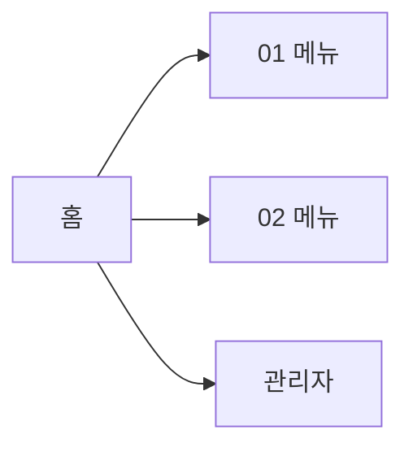

# {{SERVICE_NAME}} 사이트맵

- 조사일: {{BENCHMARK_DATE}}
- 계정 권한: {{ACCOUNT_ROLE}} / 요금제: {{PLAN_TIER}}

## 1. 전역 구조 (IA)

| 영역 | 구성 요소 |
|---|---|
| 상단 GNB | <로고, 대메뉴, 통합 검색, 알림, 프로필 등> |
| 좌측 LNB | <대메뉴별로 바뀌는 하위 메뉴 구조> |
| 사용자 메뉴 | <프로필 드롭다운 항목> |
| 관리자 진입 | <관리자 화면으로 가는 경로> |
| 기타 | <퀵메뉴, 위젯, 플로팅 버튼 등> |

## 2. 메뉴 트리

`menu_id`는 폴더명과 캡처 파일명에 그대로 쓰입니다.

| menu_id | 대메뉴 | 중메뉴 | 소메뉴 | URL 패턴 | 권한 | 표준 분류 | 비고 |
|---|---|---|---|---|---|---|---|
| `01-<slug>` | <대메뉴> | <중메뉴> | <소메뉴> | `/path/:id` | 사용자/관리자 | <std_category> | <새 창, 요금제 제한 등> |

## 3. 관리자 메뉴 트리

| menu_id | 대메뉴 | 중메뉴 | 소메뉴 | URL 패턴 | 표준 분류 | 비고 |
|---|---|---|---|---|---|---|
| `90-admin-<slug>` | <대메뉴> | <중메뉴> | <소메뉴> | `/admin/path` | <std_category> | |

> 관리자 메뉴는 `90-`부터 번호를 붙여 사용자 메뉴와 구분합니다.

## 4. 접근 불가·제한 메뉴

| 메뉴 | 이유 (권한 / 요금제 / 기타) |
|---|---|
| <메뉴> | <이유> |

## 5. 예상 작업량

| 항목 | 수량 |
|---|---|
| 대메뉴 | <n> |
| 리프 메뉴 | <n> |
| 예상 캡처 수 | <n> |
| 권장 세션 분할 | <예: 대메뉴 2~3개씩 1세션> |
